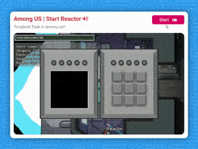
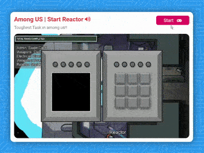
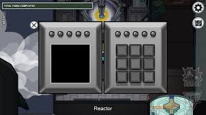

# Among Us | Start Reactor

## Play the Start Reactor Game
Play the challenging "Start Reactor" mini-game inspired by Among Us. [Click to Play](https://mo7ammedd.github.io/Among-us-reactor/)

---

## Game Preview

---

## Inspiration

---

## Overview

### About the Game
"Among Us | Start Reactor" is a game I've developed using JavaScript and jQuery, based on the popular game Among Us. The game simulates the "Start Reactor" task from Among Us.

### How to Play
Your objective is to replicate the displayed pattern on the left side of the reactor by pressing the keys shown on the right keypad. Follow these steps:

1. When the game starts, a black screen appears on the left with squares lighting up in a specific order.
2. Memorize the order in which the blue squares light up. The order becomes more complex with each pattern.
3. Replicate the pattern by tapping the corresponding keys on the right keypad.
4. Pay attention to the number of squares in each pattern as they increase.
5. Successfully replicate the pattern to progress.

Remember:
- Wait until the left screen finishes displaying the squares before entering the keypad pattern.
- If you enter the pattern incorrectly, the blue squares flash red, and you can try again.
- Green circles above the left screen indicate patterns replicated, while those above the keypad show your progress.

Have fun and challenge yourself!

---

## How to Contribute

If you're interested in contributing to the game's development, here's how you can do it:

1. Fork the repository.
2. Create a new branch for your feature or improvement.
3. Make your changes, following the project's coding standards.
4. Commit your changes with descriptive messages.
5. Push your branch to your forked repository.
6. Create a pull request, explaining your changes and their significance.

Your contributions are appreciated!

---

## License

This project is licensed under the [MIT License](LICENSE).
